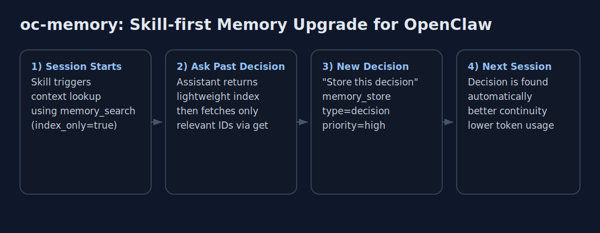

# oc-memory

Rust 기반 로컬 AI 메모리 엔진입니다. OpenClaw/Claude Code에 MCP로 연결하고, `SKILL.md` 기반 스킬을 설치하면 세션마다 기억을 검색/저장하는 워크플로우를 바로 사용할 수 있습니다.


English README: `README.en.md`

## 핵심 목표

- **Skill-first UX**: 스킬 설치만으로 메모리 검색/저장 패턴을 표준화
- **100% Local**: 외부 API 키 없이 임베딩 + 검색 로컬 실행
- **한국어 강점**: BGE-m3-ko + lindera BM25 조합
- **Token Efficiency**: `index_only` 기반 progressive disclosure

## OpenClaw 통합 (권장 경로)

### OpenClaw 클라우드 실설치 검증 (Ubuntu 24.04)

실제 클라우드 환경(OpenClaw)에서 아래 항목을 검증했습니다.

- `cargo test --workspace` 전체 통과 (core/search/mcp/server)
- `cargo build --release --workspace` 성공
- 산출물: `target/release/oc-memory-mcp` / `target/release/oc-memory-server` (각 약 95MB)

### 0) 클라우드 선행 설치 (필수)

```bash
sudo apt update
sudo apt install -y build-essential pkg-config libssl-dev clang cmake curl

curl --proto '=https' --tlsv1.2 -sSf https://sh.rustup.rs | sh -s -- -y
source "$HOME/.cargo/env"

rustc --version
cargo --version
```

### 0) One-liner 설치 (복붙)

OpenClaw 환경에서 빠르게 시작할 때:

```bash
source "$HOME/.cargo/env" && \
mkdir -p ~/.config/oc-memory && \
cargo build --release --workspace && \
python3 - <<'PY'
import json
from pathlib import Path

cfg = Path.home() / ".claude" / "config.json"
cfg.parent.mkdir(parents=True, exist_ok=True)
data = {}
if cfg.exists():
    try:
        data = json.loads(cfg.read_text(encoding="utf-8"))
    except Exception:
        data = {}
data.setdefault("mcpServers", {})["memory"] = {
    "command": str(Path.cwd() / "target/release/oc-memory-mcp"),
    "args": []
}
cfg.write_text(json.dumps(data, ensure_ascii=False, indent=2), encoding="utf-8")
print(f"Updated MCP config: {cfg}")
PY
```

### 1) 바이너리 빌드

```bash
source "$HOME/.cargo/env"
cargo build --release --workspace
```

생성 바이너리:

- `target/release/oc-memory-mcp`
- `target/release/oc-memory-server`

### 2) MCP 서버 등록

`~/.claude/config.json`(또는 OpenClaw가 참조하는 동일 형식 설정)에 등록:

```json
{
  "mcpServers": {
    "memory": {
      "command": "/absolute/path/to/target/release/oc-memory-mcp",
      "args": []
    }
  }
}
```

### 3) 스킬 설치/등록

이 저장소의 `SKILL.md`를 OpenClaw 스킬 시스템에 등록하면, 아래 패턴이 자동화됩니다.

- 세션 시작 시 선호도/최근 컨텍스트 검색
- 중요 결정/선호/버그 해결책 저장
- `index_only -> memory_get`의 토큰 절약형 조회 흐름

## 1분 데모

아래 흐름 그대로면 “스킬 설치만으로 메모리 품질 향상”이 동작합니다.



```bash
# 1) 통합 후 세션 시작
# 2) "지난번 결정 뭐였지?" 질문
# 3) memory_search(index_only=true) -> 필요한 항목만 memory_get
# 4) "이 결정 저장해줘" -> memory_store(decision/high)
```

## 자동 회수(E2E)

새 세션에서 prior-context 질문을 바로 회수하려면:

```bash
bash scripts/oc-memory-auto-recall.sh "최근 작업" 3
```

OpenClaw 전용 메모리(Always-on) 규칙 저장/검증 절차는 `SKILL.md`의 자동 회수 섹션을 사용하세요.

## 제공 MCP 도구

- `memory_search`: 하이브리드 검색 (vector + BM25)
- `memory_store`: 메모리 저장
- `memory_get`: ID 기반 전체 조회
- `memory_delete`: 메모리 삭제
- `memory_stats`: 시스템 통계

## 아키텍처

```text
crates/
├── core/          # 모델, SQLite storage, config
├── embeddings/    # BGE-m3-ko ONNX Runtime
├── search/        # usearch HNSW + BM25 + hybrid scoring
├── observer/      # file watcher
├── mcp-server/    # MCP JSON-RPC stdio
└── server/        # REST API (axum)
```

검색 점수:

```text
score = semantic(0.6) + keyword(0.15) + recency(0.15) + importance(0.10)
recency = exp(-ln(2)/30 * days_since_access)
```

## 검증 상태

현재 워크스페이스 기준:

- `cargo test --workspace`: **105 passed, 0 failed**
- `cargo build --workspace`: 성공
- `cargo clippy --workspace -- -D warnings -A clippy::arc-with-non-send-sync`: 성공

## CI/CD

워크플로우: `.github/workflows/ci.yml`

- 트리거: `push(main)`, `pull_request(main)`, `workflow_dispatch`, `schedule`(주 1회)
- `check` 잡: build/test/clippy/fmt + `cargo audit`
- `release-build` 잡: main 브랜치에서 release build 후 아티팩트 업로드

## 트러블슈팅 (OpenClaw 클라우드 설치)

### 1) `rustc: command not found`

```bash
curl --proto '=https' --tlsv1.2 -sSf https://sh.rustup.rs | sh -s -- -y
source "$HOME/.cargo/env"
```

### 2) `linker cc not found`

```bash
sudo apt update
sudo apt install -y build-essential pkg-config libssl-dev clang cmake
```

### 3) `lindera-ko-dic` 사전 URL 깨짐 (`invalid gzip header`, `NoSuchBucket`)

현재 CI에서는 자동 패치가 포함되어 있고 (`.github/workflows/ci.yml`),
로컬/클라우드 수동 빌드에서는 아래 우회가 필요할 수 있습니다.

```bash
cargo fetch
BUILDRS=$(find ~/.cargo/registry/src -path '*/lindera-ko-dic-*/build.rs' | head -1)
sed -i 's|https://lindera.s3.ap-northeast-1.amazonaws.com/mecab-ko-dic-2.1.1-20180720.tar.gz|https://bitbucket.org/eunjeon/mecab-ko-dic/downloads/mecab-ko-dic-2.1.1-20180720.tar.gz|' "$BUILDRS"
```

중요: 이 방식은 Cargo registry 캐시 파일 임시 수정이라 환경 초기화/클린 빌드에서 다시 깨질 수 있습니다.
영구 대응은 의존성 패치/고정 전략을 별도로 관리해야 합니다.

### 4) systemd 서비스 전환 예시 (observer -> Rust server)

`/etc/systemd/system/oc-memory.service`:

```ini
[Unit]
Description=oc-memory REST Server
After=network.target

[Service]
Type=simple
User=root
WorkingDirectory=/root/oc-memory
ExecStart=/root/oc-memory/target/release/oc-memory-server
Restart=always
RestartSec=5
Environment=RUST_LOG=info
Environment=LD_LIBRARY_PATH=/root/oc-memory/.venv-model/lib/python3.12/site-packages/onnxruntime/capi

[Install]
WantedBy=multi-user.target
```

```bash
sudo systemctl daemon-reload
sudo systemctl enable oc-memory.service
sudo systemctl restart oc-memory.service
curl -sS http://127.0.0.1:6342/api/v1/stats
```

검증 기준:
- `has_embedder: true`
- `search_mode: "hybrid"`

## 로컬 개발

```bash
source "$HOME/.cargo/env"

cargo fmt --all
cargo clippy --workspace -- -D warnings -A clippy::arc-with-non-send-sync
cargo test --workspace
cargo build --release --workspace
```

모델 다운로드:

```bash
# 권장 (venv + prebuilt ONNX 다운로드)
bash scripts/setup_model.sh

# 또는
# prebuilt ONNX 직접 다운로드
python3 scripts/download_model.py

# 선택: 로컬 변환/양자화
python3 scripts/download_model.py --convert
```

## 문서

- 통합/트리거 가이드: `SKILL.md`
- 개발 제약/아키텍처 참고: `CLAUDE.md`

## 라이선스

MIT
